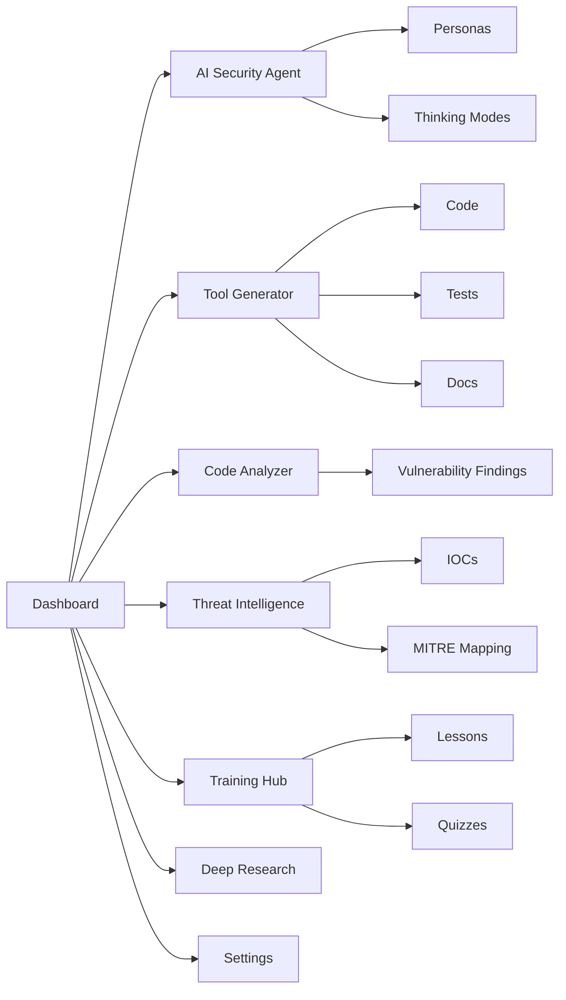

<!--
  RedHydra AI README
  Generated for the ai-security-tool-assistant React + Vite project.
-->

<div align="center">


<p>
  
</p>

<p>
  
  
  
  
</p>

<p>
  
  
  
  
</p>

<h3>Modern dark cybersecurity dashboard for tool generation, code review, threat intelligence, learning, and deep security research.</h3>

<a href="#-quick-start">Quick Start</a>
·
<a href="#-features">Features</a>
·
<a href="#-tech-stack">Tech Stack</a>
·
<a href="#-project-structure">Structure</a>
·
<a href="#-ethical-use">Ethical Use</a>

</div>

---

## ✨ Overview

**RedHydra AI** is a sleek cybersecurity assistant built with **React, TypeScript, Vite, and Tailwind CSS**. It brings multiple security workflows into one interactive dashboard: AI security chat, vulnerability-focused code analysis, threat intelligence, security tool generation, training modules, and guided deep research.

The app uses a modern dark UI with gradient cards, animated page transitions, clean panels, and practical security-focused modules.

---

## 🔥 Features

<table>
  <tr>
    <td width="50%">
      <h3>🛡️ Security Dashboard</h3>
      <p>Central dashboard with security stats, vulnerability distribution, attack surface summary, quick actions, and recent activity tracking.</p>
    </td>
    <td width="50%">
      <h3>🤖 AI Security Agent</h3>
      <p>Chat interface with multiple personas, thinking modes, web-search toggle UI, animated reasoning chain, and security-focused response formatting.</p>
    </td>
  </tr>
  <tr>
    <td width="50%">
      <h3>🧰 Tool Generator</h3>
      <p>Generate security tool templates with code, tests, and documentation for scanners, analyzers, auditors, forensics tools, and defensive scripts.</p>
    </td>
    <td width="50%">
      <h3>🔎 Code Analyzer</h3>
      <p>Analyze Python, JavaScript, and TypeScript snippets for vulnerabilities with severity counts, CWE references, PoC-style notes, and fix guidance.</p>
    </td>
  </tr>
  <tr>
    <td width="50%">
      <h3>📡 Threat Intelligence</h3>
      <p>Browse and filter threat entries with IOCs, MITRE ATT&CK mappings, mitigation steps, and defensive strategy planning.</p>
    </td>
    <td width="50%">
      <h3>🎓 Training Hub</h3>
      <p>Learn security concepts through lessons, quizzes, red-team simulations, OPSEC modules, privacy workflows, and vulnerability awareness content.</p>
    </td>
  </tr>
  <tr>
    <td width="50%">
      <h3>🔬 Deep Research</h3>
      <p>Simulate structured cybersecurity research with source-style sections, implementation frameworks, and measurable security outcomes.</p>
    </td>
    <td width="50%">
      <h3>⚙️ Settings & UX</h3>
      <p>Clean settings area, responsive sidebar navigation, single-file Vite build support, smooth transitions, and polished dark theme.</p>
    </td>
  </tr>
</table>

---

## 🧠 AI Personas

RedHydra AI includes focused security personas for different use cases:

| Persona | Purpose |
|---|---|
| 🛡️ **Security Assistant** | General security guidance, awareness, and practical advice |
| 🎯 **Red Team Specialist** | Authorized offensive security thinking and simulation support |
| 💻 **Code Security Expert** | Secure coding, vulnerability review, and remediation guidance |
| 📡 **Threat Analyst** | Threat intelligence, IOCs, MITRE context, and risk analysis |
| 🏰 **Blue Team Commander** | Defensive strategy, incident response, and control planning |

### Thinking Modes

| Mode | Best For |
|---|---|
| ⚡ **Quick** | Fast and concise answers |
| 🧠 **Deep Think** | Detailed technical analysis |
| 🔬 **Deeper** | Longer, structured, multi-layered reasoning output |

---

## 🧱 Tech Stack

<div align="center">

| Layer | Technology |
|---|---|
| Frontend | React 19 + TypeScript |
| Build Tool | Vite 7 |
| Styling | Tailwind CSS 4 |
| Icons | Lucide React |
| Utilities | clsx, tailwind-merge |
| Packaging | vite-plugin-singlefile |

</div>

---

## 🚀 Quick Start

### 1. Clone the repository

```bash
git clone https://github.com/your-username/redhydra-ai.git
cd redhydra-ai
```

### 2. Install dependencies

```bash
npm install
```

### 3. Start the development server

```bash
npm run dev
```

### 4. Build for production

```bash
npm run build
```

### 5. Preview production build

```bash
npm run preview
```

> **Recommended:** Use Node.js 20+ for the smoothest Vite experience.

---

## 📜 Available Scripts

| Command | Description |
|---|---|
| `npm run dev` | Start the local development server |
| `npm run build` | Create a production build |
| `npm run preview` | Preview the production build locally |

---

## 🗂️ Project Structure

```text
redhydra-ai/
├── index.html
├── package.json
├── package-lock.json
├── tsconfig.json
├── vite.config.ts
└── src/
    ├── App.tsx
    ├── main.tsx
    ├── index.css
    ├── types.ts
    ├── components/
    │   ├── ChatAgent.tsx
    │   ├── CodeAnalyzer.tsx
    │   ├── Dashboard.tsx
    │   ├── DeepResearch.tsx
    │   ├── Settings.tsx
    │   ├── Sidebar.tsx
    │   ├── ThreatIntel.tsx
    │   ├── ToolGenerator.tsx
    │   ├── ToolLibrary.tsx
    │   ├── TrainingHub.tsx
    │   └── UserGuide.tsx
    └── utils/
        ├── aiEngine.ts
        ├── cn.ts
        ├── crypto.ts
        ├── deepResearch.ts
        ├── securityTools.ts
        ├── threatIntel.ts
        └── trainingData.ts
```

---

## 🧭 App Flow



---

## 🎨 UI Highlights

- 🌑 Dark cyber-themed interface
- 🌈 Red, purple, cyan, amber, and emerald accent gradients
- ⚡ Smooth fade and slide-up animations
- 🧭 Collapsible sidebar navigation
- 🧩 Card-based dashboard layout
- 📊 Security metrics and visual indicators
- 🧠 Animated AI thinking chain
- 📱 Responsive grid design

---

## 🧪 Security Modules

### Code Analyzer

The analyzer is designed to highlight risky coding patterns and provide practical remediation support. It includes:

- Severity-based vulnerability summary
- CWE-style labels
- Explanation of the issue
- Fix recommendations
- Proof-of-concept style notes for learning and validation

### Threat Intel

The threat intelligence module includes example entries for:

- APT campaigns
- Malware operations
- CVE-style vulnerabilities
- Attack techniques
- OPSEC and defensive planning

### Training Hub

Training content includes security lessons, quizzes, and scenario-based exercises covering areas such as:

- STRIDE threat modeling
- OWASP vulnerability awareness
- Red-team simulation
- OPSEC workflows
- Privacy by design

---

## 🔐 Ethical Use

This project is intended for **education, defensive security, awareness training, authorized testing, and secure development support**.

Please do **not** use this project to attack systems, bypass access controls, steal data, deploy malware, or perform unauthorized scanning. Always test only on systems you own or have clear permission to assess.

---

## 🛣️ Roadmap Ideas

- [ ] Add real API integration for AI providers
- [ ] Add authenticated user sessions
- [ ] Add persistent project history
- [ ] Export analysis reports as PDF/Markdown
- [ ] Add real CVE/NVD threat feed integration
- [ ] Add SBOM and dependency scanning
- [ ] Add local encrypted workspace storage
- [ ] Add role-based training paths
- [ ] Add CI/CD security checks

---

## 🤝 Contributing

Contributions are welcome. A good workflow is:

1. Fork the repository
2. Create a feature branch
3. Make your changes
4. Test the app locally
5. Submit a pull request

```bash
git checkout -b feature/amazing-security-module
npm install
npm run dev
```

---

## 📄 License

This project can be released under the **MIT License**.

```text
MIT License

Copyright (c) 2026 RedHydra AI

Permission is hereby granted, free of charge, to any person obtaining a copy
of this software and associated documentation files, to deal in the Software
without restriction, including without limitation the rights to use, copy,
modify, merge, publish, distribute, sublicense, and/or sell copies of the
Software, subject to the conditions of the MIT License.
```

---

<div align="center">


<h3>⭐ If you like RedHydra AI, give it a star and keep building safer systems.</h3>

<p>
  <strong>Built for ethical hackers, blue teams, students, and security builders.</strong>
</p>

</div>
